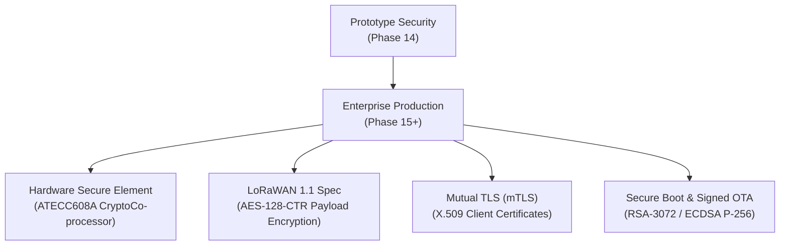

# LANDGUARD AI — Threat Model & Edge Cybersecurity Architecture

> **Document Version:** v1.0.0 (SIH 2026 Prototype Specification)  
> **Status:** Implemented (Phase 14 Specification)  
> **Classification:** Technical Security Documentation  

---

## 1. Executive Summary & Security Objectives

LANDGUARD AI is an autonomous, physics-informed AI early warning system designed for mission-critical landslide detection in railway and mountainous corridors. Because early warning alerts can trigger emergency rail stoppages and civil evacuations, the telemetry pipeline must guarantee:

1. **Authenticity:** Telemetry packets originate exclusively from authorized sensor nodes.
2. **Integrity:** Sensor readings (soil moisture, 3D tilt, rainfall) cannot be altered or corrupted in transit.
3. **Replay Immunity:** Historical packets cannot be re-injected to trigger false alarms or conceal active slope failure.
4. **Resilience & Availability:** The system must continue operating offline when external Internet connectivity fails.

---

## 2. System Architecture & Threat Surface

```
[ ESP32 Sensor Node ] ──(LoRa 433MHz RF)──> [ ESP32 LoRa Gateway ] ──(Wi-Fi/Local HTTP)──> [ Local Laptop FastAPI ] ──> [ SQLite DB & ML ]
   (LG-N01..LG-N04)                           (Ring Buffer)                                    (Edge Core)              (Zero Cloud)
```

### Key Attack Vectors & Threat Model

| Threat ID | Threat Vector | Impact | Risk Level |
| :--- | :--- | :--- | :--- |
| **TH-01** | **RF Replay Attack** | Malicious actor captures valid RF packets and re-transmits them later to cause false alarms or mask active displacement. | **HIGH** |
| **TH-02** | **Rogue / Spoofed Node Injection** | Attacker transmits synthetic packets with fabricated node IDs. | **HIGH** |
| **TH-03** | **Packet Corruption & RF Noise** | Severe weather / atmospheric interference causes bit flips in RF packets. | **MEDIUM** |
| **TH-04** | **Unauthenticated API Flooding** | Attacker on local network spams `/api/telemetry` endpoint. | **MEDIUM** |
| **TH-05** | **Internet Outage / Network Severance** | Severe rainstorm severs cellular/ISP uplink to central cloud servers. | **HIGH** |

---

## 3. Implemented Prototype Cybersecurity Controls (Phase 14)

### 3.1. Monotonic Sequence Tracking & Replay Attack Defense
Every telemetry transmission contains a 32-bit monotonically increasing sequence number (`seq_num`).
- **Watermarking Rule:** Both the ESP32 Gateway and the FastAPI Backend maintain the highest sequence number seen per authorized node ID ($S_{\text{watermark}}$).
- **Evaluation Logic:**
  - $\text{If } S_{\text{new}} > S_{\text{watermark}} \implies \textbf{ACCEPT}$ (Update $S_{\text{watermark}} \leftarrow S_{\text{new}}$)
  - $\text{If } S_{\text{new}} \le S_{\text{watermark}} \implies \textbf{REJECT — REPLAY DETECTED}$ (HTTP `409 Conflict`)
- **Audit Logging:** Every rejection is logged in the `security_events` database with timestamp, node ID, sequence number, and IP address.

### 3.2. Device ID Registry Whitelisting
Incoming packets must match a known node ID from the authorized registry (`LG-N01`, `LG-N02`, `LG-N03`, `LG-N04`). Unregistered or rogue IDs (e.g. `ROGUE-NODE-99`) are rejected (`403 Forbidden: REJECT — UNAUTHORIZED`) and flagged in the security audit stream.

### 3.3. Binary CCITT-16 CRC Message Integrity
Packets transmitted over LoRa RF utilize a strict 32-byte packed binary structure with magic preamble byte `0xAA` and trailing CCITT-16 checksum ($x^{16} + x^{12} + x^5 + 1$). The gateway verifies the CRC before generating the acknowledgement frame (`ACK:LG-N01:seq`); corrupted frames are dropped immediately at the physical layer.

### 3.4. Edge Gateway Ingestion Authentication
The FastAPI `/api/telemetry` and `/api/telemetry/sync` endpoints support `X-API-Key` header authentication to verify that incoming HTTP payloads originate exclusively from the authorized local LoRa gateway.

### 3.5. Offline-First Architectural Immunity (Phase 13)
The system has **zero runtime dependencies** on external cloud AI APIs (OpenAI, Gemini), cloud databases, or public Internet connectivity.
- **Local Gateway Ring Buffer:** Stores up to 64 telemetry frames in SRAM/Flash if local Wi-Fi drops.
- **Local FastAPI & SQLite:** Ingests, processes Gray-Box physics ($\text{FoS}$ limit equilibrium), runs local XGBoost ML inference, and serves the mission control dashboard completely offline on `localhost`.
- **Sync Flusher:** Flushes buffered packets to `/api/telemetry/sync` when connectivity recovers.

---

## 4. Security Audit Log Schema

Security incidents and validation actions are logged in SQLite table `security_events`:

```sql
CREATE TABLE security_events (
    id INTEGER PRIMARY KEY AUTOINCREMENT,
    timestamp DATETIME NOT NULL,
    node_id VARCHAR(32) NOT NULL,
    sequence_num INTEGER,
    action VARCHAR(32) NOT NULL, -- ACCEPTED, REJECTED_REPLAY, REJECTED_UNAUTHORIZED, REJECTED_CHECKSUM
    reason TEXT NOT NULL,
    client_ip VARCHAR(64)
);
```

---

## 5. Enterprise Production Security Roadmap (Future Upgrades)

For production deployment across the Indian Railways network, the following enterprise security layers will be integrated:



1. **Hardware Secure Elements (ATECC608A):** Secure key storage in tamper-resistant silicon on sensor nodes to prevent physical key extraction.
2. **LoRaWAN 1.1 Specification:** Full AES-128-CTR end-to-end payload encryption with session keys derived from network join handshakes.
3. **Mutual TLS (mTLS):** Gateway and edge laptop authenticate each other via X.509 digital certificates issued by a private Certificate Authority.
4. **Secure Boot & Signed OTA:** Cryptographically signed firmware images preventing unauthorized modifications to edge devices.
